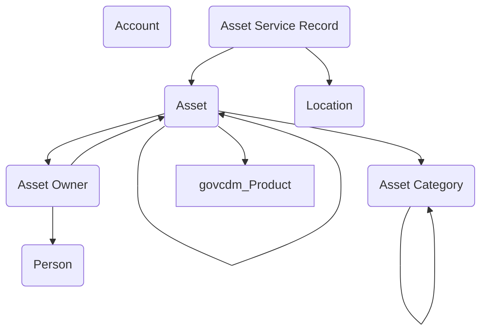

## Asset Management: Tracking Resources Across the Government Enterprise

The **Asset Management** module provides a streamlined data model for managing the physical and accountable resources that government agencies rely on to carry out their missions. From vehicles and IT equipment to specialized tools and facilities, government programs need a reliable way to track what assets exist, where they are, who is responsible for them, and how they are maintained. This module establishes that foundation in Dataverse, giving agencies a reusable structure that can stand alone or integrate with broader operational applications.

At its center is the **Asset** table, which represents any managed resource. Each asset is classified using an **Asset Category**, allowing agencies to group items by type—such as vehicles, laptops, furniture, or laboratory equipment. Categories can support reporting, lifecycle rules, or even financial treatment, giving organizations a flexible way to differentiate between high-value assets, consumables, or controlled items.

Responsibility for assets is modeled through the **Asset Owner** table, which links people or accounts to specific items. Owners may be individual staff, organizational units, or external partners, ensuring clear accountability no matter how the asset is managed. The **Person** and **Account** tables provide the anchor for this responsibility, while **Location** defines the physical place where the asset is housed or deployed. This combination allows agencies to answer critical questions like “Who is responsible for this item?” and “Where is it right now?”—both essential for inventory accuracy and audit readiness.

The lifecycle of an asset is tracked through **Asset Service Records**, which capture maintenance, inspections, repairs, or other service events. By recording dates, service types, and outcomes, agencies can monitor asset condition and plan for replacement or retirement. Service records also create a history that supports compliance with regulatory standards, particularly in areas like fleet management, IT security, or health and safety equipment.

In practice, this model can support a wide range of use cases. A facilities program could use it to track building systems and their service schedules. A fleet office might use Asset Categories for vehicles, linking them to service records for oil changes, inspections, and repairs, while tying responsibility back to specific drivers or units. An IT office could log laptops and mobile devices, connect them to their assigned users, and monitor replacement cycles through service records.

By combining accountability, categorization, location tracking, and service history, the Asset Management module gives agencies a complete picture of their resources. It reduces duplication of effort across programs, supports better stewardship of government property, and ensures that mission-critical assets are properly maintained and assigned. As with other reusable data models, it is designed to plug into larger solutions, helping agencies manage resources in context with the people, programs, and processes they support.

## Entity Relationship Diagram
---

