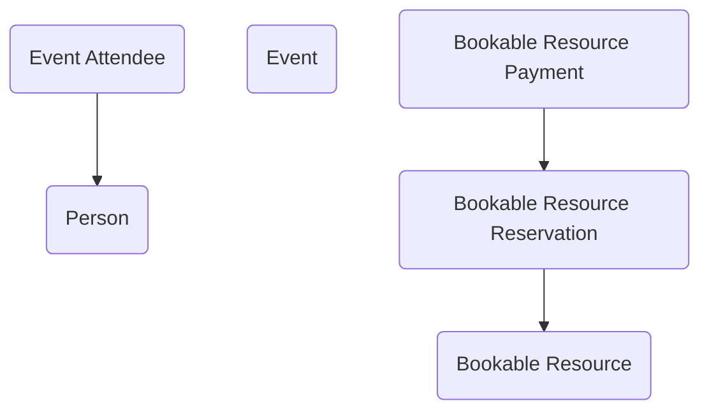

## Event Management: A Data Model for Planning and Coordinating Activities

The **Event Management** module provides a flexible structure for agencies to plan, schedule, and manage events of all kinds—from training sessions and public meetings to resource reservations and internal workshops. Events are a routine part of government operations, yet they often require coordinating people, places, and resources in a way that can quickly become complex. This module brings those pieces together in Dataverse, creating a consistent framework for tracking who is attending, what resources are needed, and how costs are managed.

At the center of the model is the **Event** table, which represents a single scheduled activity. Events can be tied to a **Person** as organizer or speaker, and they serve as the anchor for attendee management, resource reservations, and payments. The **Event Attendee** table records each person’s participation, whether as a guest, registrant, or staff member. By capturing attendee details in structured form, agencies can monitor participation levels, manage registration, and support reporting requirements.

Resource management is a key feature of this model. **Bookable Resources** represent the rooms, equipment, or other assets needed to support events. Through **Bookable Resource Reservations**, these resources can be scheduled against a specific event, ensuring availability is managed and conflicts are avoided. For events that involve costs—such as paid training or use of external venues—the **Bookable Resource Payment** table records charges and payments tied to reservations, linking financial data directly to the event record.

In practice, this module can support many scenarios. A training office could use it to schedule classes, record attendees, reserve rooms and projectors, and track cost recovery through payments. A public engagement office might organize community meetings, log RSVPs as attendees, and manage resource reservations for facilities. Even internal teams could benefit from the same structure to manage conference rooms, shared equipment, or recurring staff events, all within a standardized framework.

By combining events, attendees, and resources into a unified structure, the Event Management module helps agencies coordinate activities more effectively. It reduces scheduling conflicts, ensures accountability for resource use, and provides a clear record of who attended and what was required to make the event successful. Just as importantly, it delivers a reusable foundation that can be extended for specialized scenarios, from large conferences to small internal workshops, while maintaining consistency across the enterprise.

