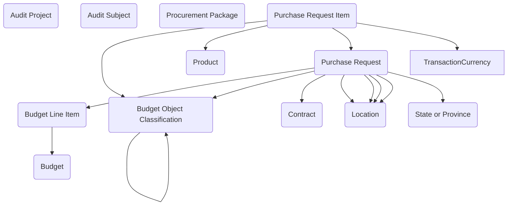

## Federal Financial: A Data Model for Budgeting, Procurement, and Oversight

The **Federal Financial** module provides a unified structure for managing the flow of money, contracts, and procurement activities in government. Agencies are expected to demonstrate fiscal responsibility, align spending with appropriations, and maintain a clear audit trail. This module delivers a Dataverse model that ties together budgeting, purchasing, and contract management, while embedding oversight through audit projects and subjects.

At the heart of the model is the **Budget** table, which represents an allocation of funds for a program, project, or fiscal period. Budgets are detailed through **Budget Line Items**, allowing agencies to track specific allocations such as travel, supplies, or salaries. Each line item is categorized using the **Budget Object Classification**, ensuring that expenditures align with federal financial standards and reporting structures. By organizing budgets in this way, agencies can manage funds at both the summary and detail level.

Procurement is captured through a chain of related tables. **Purchase Requests** are the entry point, representing requests for goods or services. Each request is broken down into **Purchase Request Items**, which identify the individual products or services needed. These items tie back to the **Product** table for standardized cataloging and can be grouped into **Procurement Packages** to support consolidated purchasing or competitive solicitations. From there, awards are formalized in the **Contract** table, which captures details such as vendors, terms, and status. **Location** and **State or Province** provide the geographic context needed for deliveries, performance sites, or jurisdictional reporting.

Oversight and accountability are embedded in the model through **Audit Projects** and **Audit Subjects**. An Audit Project represents a planned or in-progress review, while Audit Subjects link those projects to the specific budgets, contracts, or procurement activities under examination. This structure ensures that every financial action is traceable and subject to review, supporting compliance with OMB, GAO, and agency-specific requirements.

In practice, the module can support a range of scenarios. A program office might begin with a Purchase Request for IT equipment, broken into line items for laptops and accessories. These items are grouped into a Procurement Package for bidding, resulting in a Contract awarded to a vendor. The associated Budget and Line Items provide the funding source, while Audit Subjects ensure that the procurement can be examined as part of a later oversight project. Similarly, a financial management office can use the Budget and Object Classification tables to plan allocations, then reconcile those allocations against actual procurement and contract records.

By connecting budgeting, procurement, contracting, and auditing into a single structure, the Federal Financial module gives agencies a transparent and reusable way to manage public funds. It provides the rigor needed for accountability and oversight while maintaining the flexibility to support day-to-day operations. The result is a foundation for financial stewardship that agencies can trust across programs and fiscal years.

