## IT Service Management: A Data Model for Technology Operations and Compliance

The **IT Service Management** module provides a structured approach for managing the services, systems, and compliance obligations that shape the federal IT landscape. Agencies must balance day-to-day service delivery with long-term system stewardship, ensuring that technology remains secure, accredited, and aligned with federal standards. This module brings those elements together in Dataverse, creating a reusable backbone for IT support, provisioning, compliance, and accreditation.

The model supports IT operations starting at the service desk. **IT Service Requests** represent user-initiated requests for assistance or access, categorized through the **IT Service Request Type** table. Requests can involve provisioning new entitlements, reporting issues, or requesting additional services. For cases where specific access is required, **IT System Access Requests** and their associated **IT System Access Details** capture the who, what, and why of system access, ensuring compliance with least-privilege principles. Completed entitlements are recorded through **IT Assigned Entitlements** and **IT Product Entitlement**, which document what systems, applications, or products a user has been granted.

Behind the scenes, IT assets are managed through a hierarchy of systems and components. The **IT System** table represents major information systems, each of which may be broken down into **IT System Components** for applications, servers, or subsystems. Systems are tied to hosting environments defined in the **IT Datacenter** table, giving agencies visibility into infrastructure dependencies. **IT Products** represent cataloged software or hardware items, which can be linked to entitlements, service requests, or provisioning workflows through **IT Provisioning Requests**. **IT Work Assignment Codes** provide a way to link activities back to charge codes or funding allocations, aligning IT services with budget structures.

Compliance and accreditation are also core to the model. The **IT System Accreditation** table records the status of systems under federal security frameworks, such as Authority to Operate (ATO). Accreditation records can be tied to **Compliance Requirements** to ensure that systems are assessed against the correct controls. The **IT Compliance Assessment** table documents the results of evaluations, findings, and evidence collected. To manage corrective actions, **IT POAM Items** (Plans of Action and Milestones) record the steps needed to remediate gaps, creating a closed loop between compliance assessments and remediation.

In practice, this module can support a variety of IT management needs. A service desk might use it to track service requests, assign entitlements, and document provisioning. A system owner could record system components and datacenter hosting details, manage accreditation records, and document compliance assessments. Security teams can use POAM Items to ensure that findings from audits or assessments are tracked through to resolution. By linking requests, entitlements, systems, and compliance obligations in a single structure, agencies can better manage both IT operations and risk.

The IT Service Management module brings together user support, asset tracking, and compliance oversight into one model. It enables agencies to see not only who has access to what, but also whether the systems themselves are accredited, compliant, and aligned to mission needs. In short, it bridges the gap between service delivery and accountability, providing a foundation for trustworthy and efficient IT operations.

```mermaid
graph TD
  Contact(Person)
  govcdm_ComplianceRequirement(Compliance Requirement)
  govcdm_graderank(Grade-Rank)
  govcdm_ITAssignedEntitlements(IT Assigned Entitlements)
  govcdm_ITComplianceAssessment(IT Compliance Assessment)
  govcdm_ITDatacenter(IT Datacenter)
  govcdm_ITPOAMItem(IT POAM Item)
  govcdm_ITProduct(IT Product)
  govcdm_ITProductEntitlement(IT Product Entitlement)
  govcdm_ITProvisioningRequest(IT Provisioning Request)
  govcdm_ITServiceRequest(IT Service Request)
  govcdm_ITServiceRequestType(IT Service Request Type)
  govcdm_ITSystem(IT System)
  govcdm_ITSystemAccessDetail(IT System Access Detail)
  govcdm_ITSystemAccessRequest(IT System Access Request)
  govcdm_ITSystemAccreditation(IT System Accreditation)
  govcdm_ITSystemComponent(IT System Component)
  govcdm_ITWorkAssignmentCode(IT Work Assignment Code)
  govcdm_Location(Location)
  govcdm_organizationunit(Organization Unit)
  govcdm_personneltype(Personnel Type)
  govcdm_RiskItem(Risk Item)
  govcdm_stateorprovince(State or Province)
  govcdm_ITAssignedEntitlements --> Contact
  govcdm_ITComplianceAssessment --> Contact
  govcdm_ITSystemAccessRequest --> Contact
  govcdm_ITComplianceAssessment --> govcdm_ComplianceRequirement
  govcdm_ITSystemAccessRequest --> govcdm_graderank
  govcdm_ITPOAMItem --> govcdm_ITComplianceAssessment
  govcdm_ITSystem --> govcdm_ITDatacenter
  govcdm_ITSystemComponent --> govcdm_ITDatacenter
  govcdm_ITProductEntitlement --> govcdm_ITProduct
  govcdm_ITSystemAccessDetail --> govcdm_ITProduct
  govcdm_ITSystemAccessRequest --> govcdm_ITProduct
  govcdm_ITSystemComponent --> govcdm_ITProduct
  govcdm_ITAssignedEntitlements --> govcdm_ITProductEntitlement
  govcdm_ITSystemAccessDetail --> govcdm_ITProductEntitlement
  govcdm_ITSystemAccessRequest --> govcdm_ITProductEntitlement
  govcdm_ITServiceRequest --> govcdm_ITServiceRequestType
  govcdm_ITServiceRequestType --> govcdm_ITServiceRequestType
  govcdm_ITPOAMItem --> govcdm_ITSystem
  govcdm_ITSystemAccessRequest --> govcdm_ITSystem
  govcdm_ITSystemAccreditation --> govcdm_ITSystem
  govcdm_ITSystemComponent --> govcdm_ITSystem
  govcdm_ITSystemAccessDetail --> govcdm_ITSystemAccessRequest
  govcdm_ITComplianceAssessment --> govcdm_ITSystemAccreditation
  govcdm_ITPOAMItem --> govcdm_ITSystemAccreditation
  govcdm_RiskItem --> govcdm_ITSystemAccreditation
  govcdm_ITPOAMItem --> govcdm_ITSystemComponent
  govcdm_ITSystemAccessDetail --> govcdm_ITSystemComponent
  govcdm_ITSystemAccessRequest --> govcdm_ITSystemComponent
  govcdm_ITServiceRequest --> govcdm_ITWorkAssignmentCode
  govcdm_ITSystemAccessRequest --> govcdm_ITWorkAssignmentCode
  govcdm_ITSystemAccessRequest --> govcdm_Location
  govcdm_ITSystemAccessRequest --> govcdm_organizationunit
  govcdm_ITSystemAccreditation --> govcdm_organizationunit
  govcdm_ITSystemAccessRequest --> govcdm_personneltype
  govcdm_ITSystemAccessRequest --> govcdm_stateorprovince

```

