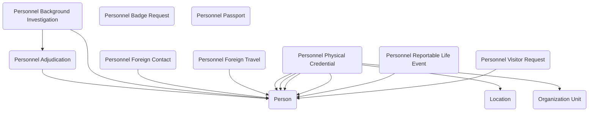

## Personnel Security: Managing Clearances, Investigations, and Access in Government

The **Personnel Security** module provides a comprehensive data model for managing the people, processes, and events that make up a federal agency’s security program. In government, safeguarding facilities, information, and systems depends on far more than issuing badges—it requires a coordinated set of checks, investigations, clearances, and ongoing monitoring. This module captures those activities in a consistent, auditable structure that can be used on its own or integrated with other government data models.

The foundation of the module is the **Person** table, which represents employees, contractors, visitors, or other individuals subject to security vetting. People can be linked to **Organization Units** and **Location** records, establishing where they work, what office they belong to, and where they need access. From there, the model branches into the many security processes that agencies manage.

**Personnel Background Investigation** and **Personnel Adjudication** tables record the investigative work and subsequent determinations that form the basis for trust. **Personnel Clearance** tracks clearance levels over time, including adjudication dates, granting authority, and expiration. These records can be tied to specific duties or systems, enabling agencies to enforce access rules and reporting requirements.

The module also supports the operational side of security access. **Personnel Badge Request** and **Personnel Physical Credential** track requests for, and issuance of, physical access devices such as ID cards or smart credentials, including status and return history. **Personnel Visitor Request** extends that capability to one-time or recurring visitors, recording the details needed for pre-approval and site access coordination.

Security risk monitoring is embedded into the model through event tracking. **Personnel Reportable Life Event** provides a structured way to capture significant changes—such as financial distress, arrests, or foreign associations—that may require re-evaluation of a person’s eligibility for clearance. **Personnel Foreign Contact** and **Personnel Foreign Travel** go deeper into counterintelligence concerns, allowing agencies to log declared contacts and trips that might present a security risk. **Personnel CV Trigger** acts as a catch-all mechanism to flag any condition or notification that should prompt a case review, investigation, or administrative action.

Finally, **Personnel Passport** keeps records of passports issued, controlled, or monitored by the agency, a necessity in organizations that sponsor official travel or manage sensitive assignments abroad.

In practice, this module brings together all of these elements into a unified view of an individual’s security profile. For example, in an insider threat program, an analyst could see at a glance a person’s clearance status, most recent adjudication, badge activity, foreign travel history, and any recent reportable life events. In visitor management, a security office could approve access based on active badge requests, linked organization units, and clearance verification.

By consolidating personnel security data into a single, extensible model, agencies can improve situational awareness, ensure compliance with federal security directives, and streamline the administrative burden of managing clearances and access. The Personnel Security module is not just a repository of records—it is an operational tool for protecting people, facilities, and the mission.

## Entity Relationship Diagram

## Requirements

Install the latest managed version of Government Data Models - Core first.

  - [Government Data Models - Core]({{ '/data-models/core/' | relative_url }})

Next, install the latest managed version of Government Data Models - Process and Tasking.

  - [Government Data Models - Process and Tasking]({{ '/data-models/process-and-tasking/' | relative_url }})