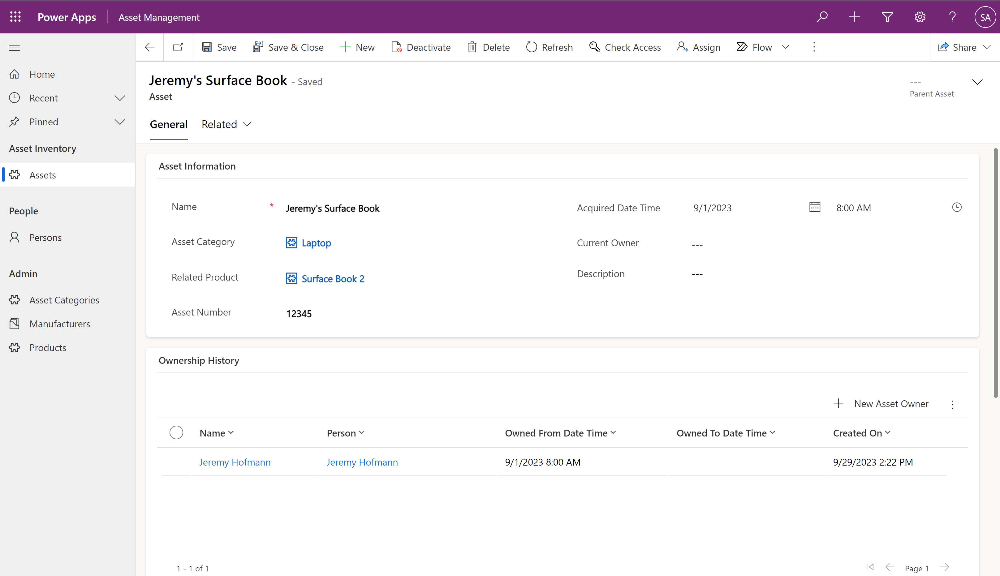
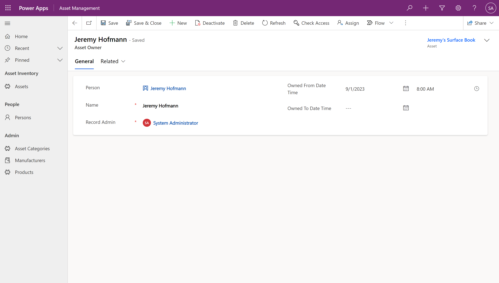
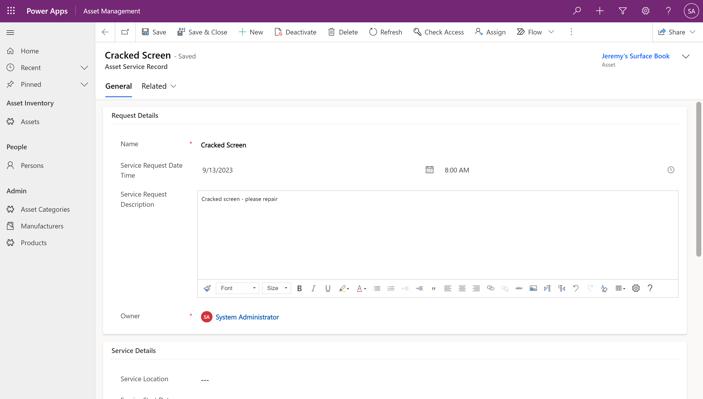

The **Asset Management** model-driven app delivers a user-friendly interface for government agencies to track, manage, and maintain their physical and accountable assets. Built on the Asset Management data model, the app provides a suite of forms, views, and dashboards that streamline asset operations and support accountability across the organization.

The app’s navigation is organized around key asset management processes, making it easy for users to find and update information. The main areas include:

## Assets
A central view lists all assets, with filters and search to quickly locate items. Users can open detailed forms to view or edit asset information, including category, owner, location, and service history. Quick create forms allow for rapid entry of new assets. 

### *Registering a New Asset* 
Users can quickly add assets using the quick create form, entering essential details and linking to categories, owners, and locations.

## Asset Categories
A dedicated view displays all asset categories, supporting easy management and standardization. Category forms let users define new types or update existing ones, ensuring assets are consistently classified.

## Asset Owners
Views and forms help agencies assign and update asset ownership, whether to individuals, teams, or external partners. Ownership changes are tracked for accountability.

## Service Records
The asset form displays all maintenance, inspections, and repairs for each asset. Users can add new service records directly from the asset form, ensuring a complete maintenance history.

### *Logging Maintenance*
Service events are added via a subgrid or related tab, capturing dates, service types, and outcomes for compliance and planning.

